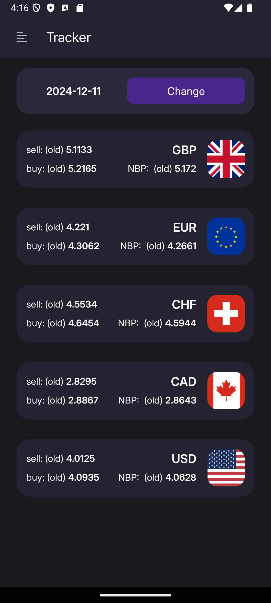

# NBP-CurrencyExchangeApp

This is a currency exchange application using the NBP API.
The project includes ASP.NET server and React Native mobile app, providing real-time exchange rates and a user-friendly experience.

## 👷 Frameworks, Libraries and Technologies

### Backend

- [C#](https://github.com/dotnet/csharplang)
- [.NET](https://github.com/dotnet/core)
- [ASP.NET Core](https://github.com/dotnet/aspnetcore)
- [MediatR](https://github.com/jbogard/MediatR)
- [Refit](https://github.com/reactiveui/refit)
- [Entity Framework Core](https://github.com/dotnet/efcore)
- [PostgreSQL](https://github.com/postgres)
- [FluentValidation](https://github.com/FluentValidation/FluentValidation)
- [Swashbuckle](https://github.com/domaindrivendev/Swashbuckle.AspNetCore)
- [Docker](https://github.com/docker)

### Mobile client

- [TypeScript](https://github.com/microsoft/TypeScript)
- [React Native](https://github.com/facebook/react-native)
- [Expo](https://github.com/expo/expo)
- [React libraries](https://reactnative.dev/docs/libraries)
- [Expo libraries](https://docs.expo.dev/workflow/using-libraries/)
- [Yup validation](https://github.com/jquense/yup)
- [Jotai state management](https://github.com/pmndrs/jotai)
- [Async-storage](https://github.com/react-native-async-storage/async-storage)


## 🐳 List of docker containers

- **api.app** - container for all application layers

- **api.database** - postgresql database container


## 🏦 API integrations

1. NBP Web API. Currency exchange rates and gold prices (National Bank of Poland)

      
      https://api.nbp.pl/en.html


## 🚜 How to run the server

1. Build and start Docker images based on the configuration defined in the docker-compose.yml

   ```sh
    make up  # docker-compose up --build
   ```

2. Stop and remove containers

   ```sh
    make down  # docker-compose down

## ⛵ How to run the mobile client 

*First of all you need to install Android Studio and create a virtual android device. You should also have node.js installed on your device.*


1. Install the necessary dependencies in the project

   ```sh
    npm i
   ```

2. Start the Expo server

   ```sh
    npm start
   ```
   
3. Run the application in the android emulator

   ```sh
    a  # the application will automatically be launched in the virtual device
   ```

## 🔐 Local access (backend)

| container    | port | login   | password | GUI                                      |
|--------------|------|---------|----------|------------------------------------------|
| api.database | 5432 | user    | password | -                                        |
| api.app      | 8000 | -       | -        | http://localhost:8000/swagger/index.html |    

## 🖨️ Swagger documentation

1. Swagger UI

        http://localhost:8000/swagger/index.html

2. [Swagger static file](https://github.com/gitEugeneL/NBP-CurencyExchangeApp/blob/dev/Server/swagger.json)

         https://github.com/gitEugeneL/NBP-CurencyExchangeApp/blob/dev/Server/swagger.json

## 🎡️ Mobile client screenshots

<div style="display: flex; gap: 10px; justify-content: center; margin-bottom: 10px">
   
   
   
</div>

<div style="display: flex; gap: 10px; justify-content: center; margin-bottom: 10px">
   
   
   
</div>

<div style="display: flex; gap: 10px; justify-content: center; margin-bottom: 10px">
   
   
   
</div>

<div style="display: flex; gap: 10px; justify-content: center; margin-bottom: 10px">
   
   
   
</div>

<div style="display: flex; gap: 10px; justify-content: center; margin-bottom: 10px">
   
   
   
</div>

<div style="display: flex; gap: 10px; justify-content: center; margin-bottom: 10px">
   
   
   
</div>

<div style="display: flex; gap: 10px; justify-content: center; margin-bottom: 10px">
   
   
   
</div>

<div style="display: flex; gap: 10px; justify-content: center; margin-bottom: 10px">
   
   
   
</div>

## 💾 Database diagram


